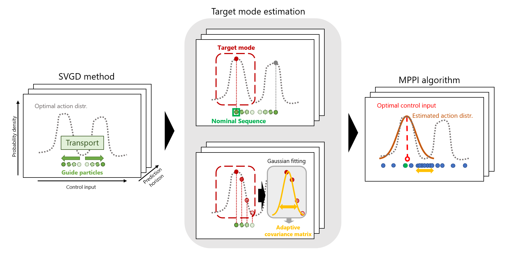

# Stein Variational Guided Model Predictive Path Integral Control (SVG-MPPI)



Demo Video
[](https://www.youtube.com/watch?v=ML_aOYQIDL0)

```bibtex
@article{honda2023stein,
      title={Stein Variational Guided Model Predictive Path Integral Control: Proposal and Experiments with Fast Maneuvering Vehicles}, 
      author={Kohei Honda and Naoki Akai and Kosuke Suzuki and Mizuho Aoki and Hirotaka Hosogaya and Hiroyuki Okuda and Tatsuya Suzuki},
      year={2023},
      eprint={arXiv:2309.11040}
}
```

## Tested Environment

- Ubuntu Focal 20.04 (LTS)
- ROS Noetic

<details>
<summary>Basic Instllation</summary>

## Install ROS noetic
[Installation guide](http://wiki.ros.org/noetic/Installation/Ubuntu)

```bash
# Set up your computer to accept software from packages.ros.org
sudo sh -c 'echo "deb http://packages.ros.org/ros/ubuntu $(lsb_release -sc) main" > /etc/apt/sources.list.d/ros-latest.list'

# Set up your keys
sudo apt install -y curl # if you haven't already installed curl
curl -s https://raw.githubusercontent.com/ros/rosdistro/master/ros.asc | sudo apt-key add -
sudo apt update

# install ROS
sudo apt install -y ros-noetic-desktop-full

# Install other tools 
sudo apt install python3-osrf-pycommon python3-catkin-tools
```

## Install Docker
[Installation guide](https://docs.docker.com/engine/install/ubuntu/#install-using-the-repository)

```bash
# Install from get.docker.com
curl -fsSL https://get.docker.com -o get-docker.sh
sudo sh get-docker.sh
sudo groupadd docker
sudo usermod -aG docker $USER
```

</details>

## Install Dependencies

```bash
cd proj-svg_mppi
make setup
```

## Build Controllers

```bash
cd proj-svg_mppi
make build
```

## Run Simulation with Visualization

Launch simulator in the Docker container
```bash
cd proj-svg_mppi
./script/launch_simulator.sh
```

Launch controllers in another terminal
```bash
cd proj-svg_mppi
./script/launch_controllers.sh 
```

You can change the all MPPI parameters and settings in [the yaml file](./src/mppi_controller/config/mppi_controller.yaml)

## Evaluation

You can reproduce all simulation results in the paper by one command: 
```bash
cd proj-svg_mppi/script
./eval_all.sh
```

Or, You can evaluate a fixed parameters by this command:
```bash
cd proj-svg_mppi/script
./eval.sh
```

**Note**: The evaluation is used asynchronous simulation using ROS. So, the results can be slightly changed even if all seeds are fixed.